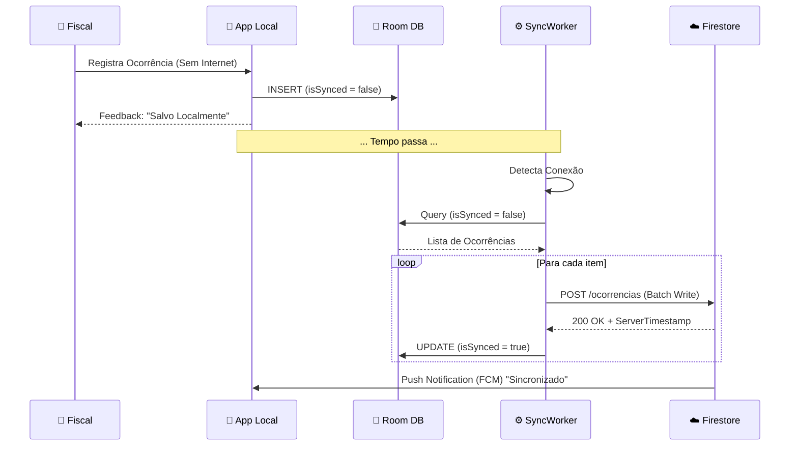
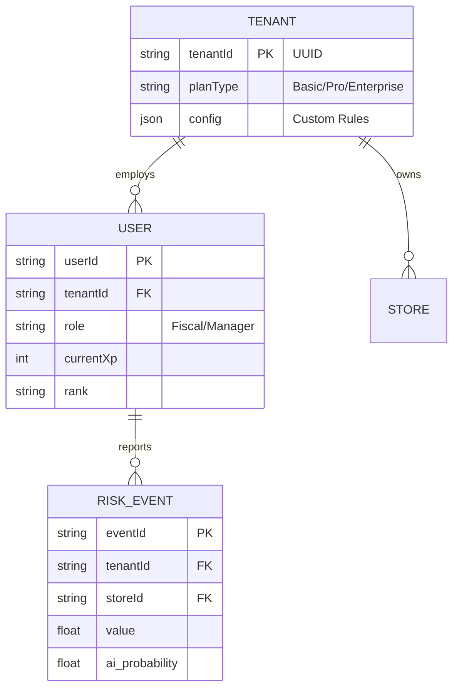

# 🏗️ Arquitetura SaaS & Escalabilidade Visual

## 1. Visão Macro do Ecossistema

O diagrama abaixo ilustra o fluxo de dados desde a ponta (Edge/Android) até a inteligência centralizada na nuvem, destacando a natureza **Offline-First** e **Multi-Tenant**.

```mermaid
graph TD
    subgraph "Edge Computing (Lojas Físicas)"
        A[📱 App Android (Fiscal)] -->|Input Tático| B(Room DB Local)
        A -->|Inferência IA| C(TensorFlow Lite)
        B <-->|Sync Manager| D{WorkManager}
    end

    subgraph "Secure Gateway & Auth"
        D -->|TLS 1.3 / Encrypted| E[🔥 Firebase Auth]
        E -->|Token Validation| F[☁️ Cloud Functions]
    end

    subgraph "Core Backend (Serverless)"
        F -->|Write/Read| G[(🔥 Firestore NoSQL)]
        F -->|Media Upload| H[(📦 Cloud Storage)]
        G -->|Trigger| I[⚡ Event Bus / PubSub]
    end

    subgraph "Data Intelligence & Analytics"
        I -->|Stream| J[BigQuery Data Warehouse]
        J -->|Training Data| K[🧠 AI Training Pipeline]
        K -->|New Model .tflite| H
        J -->|BI Dashboard| L[💻 Web Portal (Gestão)]
    end

    subgraph "Gamification Engine"
        I -->|Event: Risk Mitigated| M[🎮 Gamification Service]
        M -->|Calc XP/Rank| G
    end
```

---

## 2. Fluxo de Sincronização (Offline-First)

Detalhe técnico de como garantimos a integridade dos dados mesmo em ambientes de conectividade hostil (subsolos, áreas remotas).



---

## 3. Modelo de Dados Multi-Tenant (Isolamento)

Estrutura lógica que permite atender múltiplos clientes (Varejista A, Varejista B) na mesma infraestrutura sem vazamento de dados.



---
**Documento Técnico Confidencial - Uso Interno e Investidores**