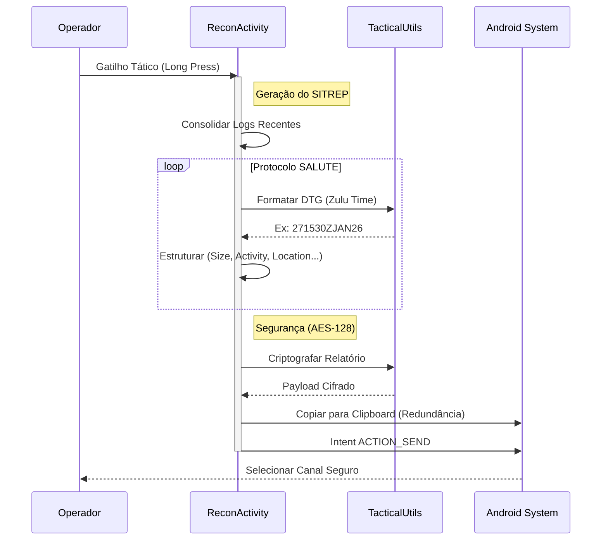
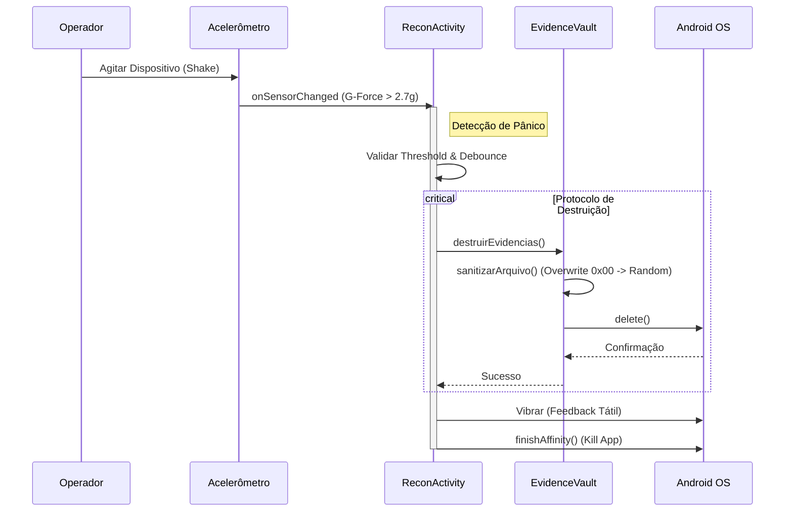

# 🛡️ Gestão de Risco - Plataforma SaaS de Prevenção de Perdas Inteligente

<div align="center">


**Plataforma inteligente para Prevenção de Perdas em varejo com IA preditiva, análise em tempo real e sincronização offline-first.**

[Visão Geral](#-visão-geral) • [Features Principais](#-features-principais) • [Arquitetura](#-arquitetura) • [Tech Stack](#-tech-stack) • [Início Rápido](#-início-rápido) • [Estrutura do Projeto](#-estrutura-do-projeto) • [Documentação Completa](#-documentação-completa) • [Roadmap](#-roadmap) • [Contribuindo](#-contribuindo) • [Licença](#-licença) • [README Técnico](#-leia-o-readme-técnico) • [Documento para Investidores](#-documento-para-investidores)


</div>

---

## 📋 Índice

- [Visão Geral](#-visão-geral)
- [Features Principais](#-features-principais)
- [Arquitetura](#-arquitetura)
- [Tech Stack](#-tech-stack)
- [Início Rápido](#-início-rápido)
- [Estrutura do Projeto](#-estrutura-do-projeto)
- [Documentação Completa](#-documentação-completa)
- [Roadmap](#-roadmap)
- [Leia o README Técnico](#-leia-o-readme-técnico)
- [Documento para Investidores](#-documento-para-investidores)
- [Contribuindo](#-contribuindo)
- [Licença](#-licença)

---

## 🎯 Visão Geral

**Gestão de Risco** é uma plataforma enterprise Android desenvolvida como um **SaaS multi-tenant** para redes varejistas gerenciarem, analisarem e preverem incidentes de furto. Combinando **offline-first architecture**, **machine learning preditivo** e **analytics em tempo real**, oferece às equipes de Prevenção de Perdas (PP) uma ferramenta decisiva para reduzir perdas e otimizar recursos.

### 🎓 Por que Gestão de Risco?

| Desafio | Solução |
|---------|---------|
| **Reatividade vs Proatividade** | IA preditiva previne incidentes antes que ocorram |
| **Dados Isolados** | Dashboard unificado com múltiplas perspectivas analíticas |
| **Connectivity Issues** | 100% funcional offline com sync automático |
| **Escalabilidade** | Arquitetura SaaS multi-tenant pronta para múltiplos clientes |
| **Decisões Lentas** | Real-time insights para decisões imediatas |

---

## 💡 Features Principais

### 🔮 Inteligência Artificial & Machine Learning
- **Modelo TensorFlow Lite Embarcado** - Predições de risco em tempo real (on-device)
- **Google ML Kit Integration** - Visão computacional avançada:
  - **OCR (Optical Character Recognition)** - Leitura automática de notas e documentos.
  - **Image Labeling** - Classificação automática de evidências fotográficas.
- **Edge AI Adaptativa** - Modelos locais que se refinam com padrões específicos da loja.
- **Atualização Dinâmica** - Download de novos modelos `.tflite` via Firebase ML sem update de APK.
- **Fallback Estatístico** - Garante funcionalidade mesmo sem modelo IA.
- **Scoring de Risco** - Cada incidente recebe score de confiança e probabilidade
- **Aprendizado Contínuo** - Dados alimentam retreinamento mensal do modelo

### ⚔️ Inteligência de Campo & Relatórios Táticos
- **SITREP (Situation Report)** - Geração automática de relatórios baseados no protocolo **SALUTE** (Size, Activity, Location, Unit, Time, Equipment).
- **Formatação Tática** - Uso de **DTG (Date-Time Group)** padrão OTAN e simulação de coordenadas **MGRS** para precisão operacional.
- **Modo Furtivo (Stealth)** - Interface de baixa luminosidade com feedback tátil para operações discretas.
- **Gatilho Tático** - Acionamento rápido de envio de inteligência via hardware keys ou gestos específicos.
- **Coleta Estruturada** - Interface otimizada para registro rápido de Movimentação, Alvos, Riscos, Recursos e Equipamentos.
- **Decodificador SITREP** - Ferramenta dedicada para o comando descriptografar relatórios de campo recebidos, garantindo a integridade da informação.
- **Assinatura Digital** - Hashing SHA-256 automático em todos os relatórios para garantir cadeia de custódia e auditoria.
- **Manobra Tática (QRF)** - Algoritmo de despacho que calcula a unidade mais próxima (Blue Force Tracking) e estima o ETA para neutralização rápida.



### 📊 Dashboard Analytics Avançado
- **Mancha Criminal (Bubble Chart)** - Identifica hotspots de risco (horário × produto × frequência)
- **Análise Econômica** - Quantifica prejuízo financeiro por loja/categoria
- **Evolução Temporal (Line Chart)** - Tendências de perdas ao longo do tempo
- **Correlação de Risco (Scatter Plot)** - Relação entre horário e valor de incidentes
- **Ranking de Categorias** - Produtos/lojas com maior incidência de furtos
- **Exportação Dinâmica** - Gráficos em CSV, PDF, XLSX para apresentações

### 🔐 Segurança & Conformidade
- **Autenticação Firebase** - Email + Biometric (fingerprint/face)
- **Isolamento Multi-Tenant** - Dados segregados por `clientId` com validação em Room + Firestore Rules
- **Conformidade LGPD** - Metadata de consentimento e direitos de dados
- **Criptografia em Trânsito** - TLS/SSL para todas as conexões Firebase
- **Proteção Biométrica** - Fingerprint/Face ID para acessar configurações e exportações
- **Evidence Vault** - Isolamento de mídia em armazenamento interno privado (`.secure_evidence_vault`), prevenindo acesso por outros apps ou galeria do sistema.
- **Panic Protocol** - Monitoramento de acelerômetro (Shake Detection) para destruição de emergência de dados sensíveis locais em caso de coação física.
- **Criptografia de Dados Operacionais** - Logs de reconhecimento (`ReconLog`) são criptografados localmente com **AES-128** via `TacticalUtils` antes da persistência.
- **Sanitização de Dados (Data Wiping)** - Implementação de sobrescrita de arquivos (Zeroing + Random) antes da deleção no `EvidenceVault`, mitigando recuperação forense de dados.
- **Armazenamento Seguro** - Uso de **EncryptedSharedPreferences** para chaves leves e **SQLCipher** para criptografia total do banco de dados Room (256-bit AES).
- **Gestão de Chaves** - Integração com **Android Keystore System** para proteção de chaves criptográficas em hardware (TEE/StrongBox).
- **Network Security** - **Certificate Pinning** via OkHttp para prevenir interceptação de tráfego (ataques Man-in-the-Middle).
- **Integridade do App** - Validação via **Play Integrity API** para garantir que o binário não foi adulterado e o ambiente é confiável.



### 🔄 Sincronização Offline-First
- **Room Local Database** - Banco SQLite com migrations automáticas
- **Background Sync (WorkManager)** - Sincronização a cada 1 hora quando conectado
- **NetworkBoundResource** - Padrão de arquitetura para orquestrar cache local e dados remotos
- **Sincronização Incremental** - Apenas dados modificados desde o último sync são transmitidos
- **Conflict Resolution** - Estratégia *Last-Write-Wins* ou *Smart Merge* para resolver conflitos Room ↔ Firestore
- **Queue de Upload** - Imagens enfileiradas para Firebase Storage com retry automático
- **Indicador de Status** - Ícone visual mostra sync status em tempo real

### 📱 UI/UX Profissional
- **Material Design 3** - Interface moderna e responsiva
- **ViewBinding** - Type-safe view access
- **Dark Mode** - Tema claro/escuro com suporte a preferência do sistema
- **Navigação Fluida** - Bottom navigation com Deep Linking
- **Acessibilidade** - WCAG compliance com tamanhos ajustáveis de texto

### 📮 Notificações & Comunicação
- **Firebase Cloud Messaging (FCM)** - Push notifications de alto valor
- **Relatórios Automáticos** - Worker semanal gera CSV e envia por email
- **Alertas Customizáveis** - Thresholds por cliente e horário
- **In-app Notifications** - Toast/Snackbar com ações contextuais

### 🗺️ Geolocalização & Mapping
- **Google Maps Integration** - Visualização de hotspots geográficos
- **Clustering** - Agrupa incidentes por região automaticamente
- **Heat Maps** - Densidade visual de risco por área
- **Drone Recon View** - Modo de visualização satélite com inclinação e HUD tático para imersão operacional.
- **GeoFencing Alerts** - Alertas automáticos quando dispositivos monitorados entram ou saem de perímetros virtuais pré-definidos.

### 🎲 Gamificação (Engine Tática)
Inspirado nos princípios de "A Arte da Guerra" de Sun Tzu, o Gestão de Risco transcende a ferramenta de trabalho para se tornar uma plataforma de engajamento e maestria.

- **Perfil de Estrategista e Patentes:** Cada usuário possui um perfil que exibe sua patente (de `Recruta` a `General Estrategista`), pontos de experiência (XP), medalhas e estatísticas de desempenho.
- **As 13 Campanhas (Missões):** Um sistema de missões baseado nos 13 capítulos de "A Arte da Guerra", que treinam o usuário em uma faceta da prevenção de perdas.
- **Medalhas de Honra (Conquistas):** Conquistas concedidas por feitos notáveis, como "Primeira Prevenção Bem-Sucedida" ou "Relatório 100% Completo".
- **Conselho de Guerra (Placares de Líderes):** Placares de líderes semanais e mensais que classificam indivíduos e equipes.
- **Arsenal (Customização):** Pontos de experiência podem ser usados para desbloquear itens cosméticos, como temas de interface e sons de notificação.
- **Rede de Inteligência (Comunidade):** Uma área onde os usuários podem compartilhar e avaliar táticas de risco observadas em campo, ganhando XP por contribuições valiosas.

---

## 🏗️ Arquitetura

### Padrão de Design

```
MVVM + Repository Pattern + Offline-First + Tenant-Aware SaaS
```

```
┌─────────────────────────────────────────────────────┐
│                 UI Layer (Activities/Fragments)     │
│            (Material Design 3 + ViewBinding)        │
└────────────────────┬────────────────────────────────┘
                     │
┌────────────────────▼────────────────────────────────┐
│            ViewModel Layer (MVVM State)             │
│         (LiveData/Flow + Coroutines)                │
└────────────────────┬────────────────────────────────┘
                     │
┌────────────────────▼────────────────────────────────┐
│         Repository Layer (Business Logic)           │
│      (Orchestrates Room + Firebase)                 │
└────────────────────┬────────────────────────────────┘
                     │
    ┌────────────────┴────────────────┐
    │                                 │
┌───▼─────────────┐         ┌────────▼────────┐
│  Room Database  │         │  Firestore DB   │
│   (Local SQLite)│         │  (Cloud Backend)│
└─────────────────┘         └─────────────────┘
```

### Princípios Arquiteturais

1. **Single Source of Truth** - Room é primária; Firestore é backup
2. **Unidirectional Data Flow** - UI → ViewModel → UseCase → Repository → Data
3. **Separation of Concerns** - Cada layer tem responsabilidade clara
4. **Dependency Injection** - Hilt para inversão de controle
5. **Reactive Programming** - Coroutines + Flow para async
6. **Multi-Tenant Isolation** - `clientId` em todas as queries

---

## 🛠️ Tech Stack

### Linguagem & Plataforma
- **Kotlin 1.9+** - Linguagem moderna, concisa, segura
- **Android SDK 26-34** - Compatibilidade ampla
- **JVM Target 17** - Versão LTS estável

### Backend & Data
- **Firebase Suite:**
  - 🔐 **Authentication** - Email + Biometric
  - 💾 **Firestore** - NoSQL em tempo real
  - 📦 **Cloud Storage** - Upload de evidências (fotos)
  - 📨 **Cloud Messaging (FCM)** - Push notifications
  - 📊 **Analytics** - Tracking de eventos
  - 💥 **Crashlytics** - Monitoramento de estabilidade e crashes
  - 🚀 **Performance Monitoring** - Métricas de latência e startup
  - 🎛️ **Remote Config** - Feature flags e atualizações dinâmicas
- **Room Database** - SQLite type-safe
- **WorkManager** - Background jobs (sync 1h)

### UI & Design
- **Material Design 3** - Design system moderno
- **ViewBinding** - Type-safe view access
- **MPAndroidChart** - Gráficos profissionais

### Geolocalização
- **Google Maps SDK** - Visualização, clustering, heatmaps.
- **GeoFencing API** - Alertas baseados em localização.
- **Mapbox SDK** - Em avaliação para customização avançada de HUD.

### Machine Learning
- **TensorFlow Lite** - On-device AI inference
- **Quantized Models** - <5MB para tamanho mínimo APK
- **Google ML Kit** - Vision API (OCR, Image Labeling)
- **Firebase ML** - Model Distribution (Over-the-Air updates)

### Architecture & DI
- **Hilt** - Dependency injection limpo
- **Repository Pattern** - Data abstraction
- **MVVM** - Separation of UI e business logic

### Async & Reactive
- **Coroutines** - Async sem callbacks
- **Flow** - Streams de dados reativos
- **LiveData** - Observable com lifecycle awareness

### Testing
- **Mockk** - Mocking framework Kotlin-native
- **Turbine** - Flow testing
- **Robolectric** - Android unit tests
- **JUnit 4** - Test framework
- **Espresso** - UI testing framework

### Build & Tooling
- **Gradle 8.13** - Build automation
- **Version Catalog** - Centralized dependency management
- **Proguard/R8** - Code minification (release)
- **MultiDex** - Suporte para 65k+ métodos

### CI/CD & Quality
- **GitHub Actions** - Automated build & test pipeline
- **Firebase App Distribution** - Beta testing delivery
- **Detekt** - Static code analysis for Kotlin
- **Ktlint** - Kotlin code style formatter

### Security
- **EncryptedSharedPreferences** - Secure key-value storage
- **SQLCipher** - Database encryption (Room)
- **Android Keystore** - Hardware-backed key storage
- **Play Integrity API** - Anti-tampering & anti-fraud
- **OkHttp Certificate Pinner** - Network security

### Observabilidade
- **Timber** - Logging estruturado e limpo
- **Firebase Crashlytics** - Reporte de erros em tempo real
- **Firebase Performance** - Monitoramento de rede e UI

---

## 🚀 Início Rápido

### Pré-requisitos

```bash
# Verificar versões
java -version                           # Java 17+
gradle --version                        # Gradle 8.13+
android --version                       # Android SDK 34+
```

### Instalação

**1. Clone o repositório**
```bash
git clone https://github.com/BraulioJr/gestao-de-risco-android.git
cd gestao-de-risco-android
```

**2. Configure Firebase** (Crítico!)
```bash
# Baixe google-services.json do Firebase Console
# Coloque em: app/google-services.json
# (Firebase Setup > Android > Download google-services.json)
```

**3. Compile o projeto**
```bash
# Debug APK
./gradlew assembleDebug

# Release APK (requer keystore)
./gradlew assembleRelease
```

**4. Instale em emulador/dispositivo**
```bash
# Automático (recomendado)
./gradlew installDebug

# Manual
adb install -r app/build/outputs/apk/debug/app-debug.apk

# Ou use script Windows
test-apk.bat
```

**5. Inicie o app**
```bash
adb shell am start -n com.example.project_gestoderisco/.MainActivity

# Ver logs
adb logcat | grep gestaoderisco
```

---

## 📁 Estrutura do Projeto

```
Project_GestaoDeRisco/
├── 📄 README_PROFESSIONAL.md ............ Este arquivo (você está aqui!)
├── 📄 START_HERE.md ..................... Guia rápido
├── 📁 .github/
│   └── 📄 copilot-instructions.md ...... Arquitetura técnica (360+ KB)
│
├── 📁 app/
│   ├── 📄 build.gradle.kts ............. Config Gradle
│   ├── 📄 google-services.json ......... Firebase (⚠️ Adicionar!)
│   └── 📁 src/
│       ├── 📁 main/
│       │   ├── 📁 java/com/example/project_gestoderisco/
│       │   │   ├── 📁 auth/ ........... Autenticação
│       │   │   ├── 📁 data/
│       │   │   │   └── local/ ........ Room Database
│       │   │   ├── 📁 dashboard/ ..... Analytics UI
│       │   │   ├── 📁 model/ ........ Domain models
│       │   │   ├── 📁 repository/ ... Data access
│       │   │   ├── 📁 view/ ........ Activities
│       │   │   ├── 📁 viewmodel/ .. UI state
│       │   │   ├── 📁 worker/ .... Background jobs
│       │   │   └── 📁 utils/ .... Helpers
│       │   │
│       │   └── 📁 res/
│       │       ├── layout/ (24+ XMLs)
│       │       ├── drawable/ (icons + vectors)
│       │       ├── anim/ (animations)
│       │       ├── menu/ (menus)
│       │       ├── values/ (colors, strings, themes)
│       │       └── xml/ (configs)
│       │
│       ├── 📁 test/ ................ Unit tests
│       └── 📁 androidTest/ ........ Integration tests
│
├── 📁 gradle/
│   └── libs.versions.toml ........... Version Catalog
│
└── 📄 README.md ..................... README original
```

---

## 🏢 Enterprise Project Structure

### Visão Geral - Arquitetura em Camadas

```
┌─────────────────────────────────────────────────────────────┐
│  📱 PRESENTATION LAYER (UI/UX)                              │
│  Activities • Fragments • Adapters • ViewBinding              │
│  Material Design 3 • Navigation • Bottom Navigation          │
└──────────────┬──────────────────────────────────────────────┘
               │ (observa eventos, mostra dados)
┌──────────────▼──────────────────────────────────────────────┐
│  🎯 VIEWMODEL LAYER (State Management)                      │
│  ViewModels • LiveData/Flow • Coroutines                    │
│  UI State Holders • Event Handlers                          │
└──────────────┬──────────────────────────────────────────────┘
               │ (orquestra lógica de negócio)
┌──────────────▼──────────────────────────────────────────────┐
│  🏗️  REPOSITORY LAYER (Business Logic)                      │
│  Repositories • Use Cases • Data Orchestration              │
│  Offline-First Sync • Conflict Resolution                   │
└──────────────┬──────────────────────────────────────────────┘
               │
    ┌──────────┴──────────┐
    │                     │
┌───▼─────────────┐  ┌────▼──────────────┐
│ 💾 LOCAL LAYER  │  │ ☁️  REMOTE LAYER  │
│ Room SQLite     │  │ Firebase Services │
│ Migrations      │  │ Real-time Sync    │
└─────────────────┘  └───────────────────┘
```

### 1️⃣ Presentation Layer (UI)

**Responsabilidades:**
- Renderizar UI conforme estado do ViewModel
- Capturar eventos do usuário
- Navegar entre telas
- Exibir notificações

**Estrutura:**
```
view/
├── MainActivity.kt ................. Hub de navegação principal
├── RiskDetailActivity.kt .......... Detalhes de incidente
├── DashboardActivity.kt .......... Analytics dashboard
├── MapActivity.kt ................. Mapa de hotspots
│
├── fragments/
│   ├── DashboardFragment.kt ....... Charts container
│   ├── RiskListFragment.kt ........ Lista de incidências
│   └── SettingsFragment.kt ........ Configurações
│
└── adapters/
    ├── OcorrenciaAdapter.kt ....... RecyclerView adapter
    ├── RiskAdapter.kt ............ Risk list adapter
    └── DashboardChartAdapter.kt .. Chart container adapter
```

**Padrões:**
- ✅ ViewBinding (type-safe view access)
- ✅ Fragment-based navigation (Jetpack Navigation)
- ✅ Material Design 3 components
- ✅ Responsive layouts (portrait/landscape)
- ✅ Accessibility (TalkBack, color contrast)

### 2️⃣ ViewModel Layer (State Management)

**Responsabilidades:**
- Manter estado UI
- Processar eventos de usuário
- Comunicar com Repository
- Recuperar estado após process death

**Estrutura:**
```
viewmodel/
├── MainViewModel.kt ............... App-wide state
├── RiskViewModel.kt .............. Risk predictions + list
├── DashboardViewModel.kt ......... Chart data aggregation
├── OcorrenciasViewModel.kt ....... Incident management
│
└── factory/
    ├── RiskViewModelFactory.kt
    ├── DashboardViewModelFactory.kt
    └── OcorrenciasViewModelFactory.kt
```

**Exemplo:**
```kotlin
// ViewModels usam LiveData/Flow para reactive updates
class RiskViewModel @Inject constructor(
    private val repository: RiskRepository
) : ViewModel() {
    
    // Público: UI observa estas LiveData
    val riskList: LiveData<List<Risk>> = repository.getRisksLive()
    val predictedRisk: LiveData<Risk?> = MutableLiveData()
    val loadingState: LiveData<LoadingState> = MutableLiveData()
    
    // Privado: lógica interna
    private fun predictRisk(incident: Ocorrencia) {
        viewModelScope.launch {
            try {
                val prediction = repository.predictRisk(incident)
                predictedRisk.value = prediction
            } catch (e: Exception) {
                // Error handling
            }
        }
    }
}
```

### 3️⃣ Repository Layer (Business Logic)

**Responsabilidades:**
- Orquestrar dados locais (Room) + remotos (Firestore)
- Aplicar regras de negócio
- Gerenciar sincronização offline-first
- Resolver conflitos de dados

**Estrutura:**
```
repository/
├── OcorrenciaRepository.kt ........ CRUD de incidentes
├── RiskRepository.kt ............ Predições + análise
├── UserRepository.kt ............ Perfil de usuário
├── SyncRepository.kt ............ Orquestração de sync
│
└── interfaces/
    ├── IRepository.kt .......... Contrato genérico
    └── ISyncable.kt ........... Interface de sync
```

**Exemplo:**
```kotlin
class OcorrenciaRepository @Inject constructor(
    private val localDao: OcorrenciaDao,
    private val remoteDb: FirebaseFirestore
) {
    
    // Read: Room é source of truth
    fun getAllOcorrencias(clientId: String): Flow<List<Ocorrencia>> {
        return localDao.getAllOcorrencias(clientId)
            .map { entities -> entities.map { it.toModel() } }
    }
    
    // Write: Save locally, mark for sync
    suspend fun createOcorrencia(ocorrencia: Ocorrencia, clientId: String) {
        val entity = ocorrencia.toEntity(clientId, synced = false)
        localDao.insert(entity)
        // WorkManager enfilera sync background
    }
    
    // Sync: Room → Firestore
    suspend fun syncOcorrencias(clientId: String) {
        val unsynced = localDao.getUnsyncedOcorrencias(clientId)
        for (entity in unsynced) {
            try {
                remoteDb.collection("clients/$clientId/ocorrencias")
                    .document(entity.id)
                    .set(entity.toDto())
                    .await()
                localDao.markAsSynced(entity.id)
            } catch (e: Exception) {
                // Retry logic
            }
        }
    }
}
```

### 4️⃣ Data Layer (Local & Remote)

#### Local: Room Database
```
data/local/
├── AppDatabase.kt ................. Database definition
│   ├── Entities: OcorrenciaEntity, UserProfileEntity
│   ├── DAOs: OcorrenciaDao, UserProfileDao
│   └── Migrations: Auto-tracked version history
│
├── dao/
│   ├── OcorrenciaDao.kt .......... CRUD + custom queries
│   │   ├── @Insert: criar
│   │   ├── @Update: atualizar
│   │   ├── @Delete: deletar
│   │   ├── @Query: queries customizadas
│   │   │   ├── getAllOcorrencias(clientId) -> Flow<List>
│   │   │   ├── getUnsyncedOcorrencias(clientId) -> List
│   │   │   └── getOcorrenciasByDateRange(...) -> Flow<List>
│   │   └── @Transaction: operações atômicas
│   │
│   ├── UserProfileDao.kt ........ Perfil do usuário
│   └── CacheDao.kt ............ Cache de dados
│
└── converter/
    ├── DateConverter.kt ........ java.util.Date ↔ Long
    ├── ListConverter.kt ....... List ↔ JSON string
    └── EnumConverter.kt ...... Enums ↔ String
```

#### Remote: Firebase Services
```
data/remote/
├── FirebaseService.kt ........... Wrapper Firebase
│   ├── Firestore queries
│   ├── Cloud Storage uploads
│   ├── Auth management
│   └── Cloud Messaging handling
│
└── dto/
    ├── OcorrenciaRequest.kt .... DTO upload
    ├── OcorrenciaResponse.kt ... DTO download
    └── RiskPredictionDto.kt ... IA response DTO
```

### 5️⃣ Supporting Layers

#### Workers (Background Jobs)
```
worker/
├── SyncWorker.kt ................ Sync automático (1h)
│   ├── Trigger: WorkManager com constraints
│   ├── Lógica: Room → Firebase Storage (images) → Firestore (data)
│   └── Retry: Exponential backoff
│
├── ArchiveWorker.kt ............ Auto-archive (semanal)
│   └── Lógica: Move dados antigos para arquivo
│
└── WeeklyReportWorker.kt ....... Relatório automático
    └── Lógica: Gera CSV + envia email
```

#### Models (Domain)
```
model/
├── Ocorrencia.kt ............... Entidade principal de domínio
│   ├── id, clientId, timestamp
│   ├── location, product, value
│   ├── status (Open, InProgress, Resolved)
│   └── attachments (fotos)
│
├── Risk.kt ................... Predição de IA
│   ├── score (0-100)
│   ├── confidence (0-1.0)
│   ├── factors (reasons for prediction)
│   └── model_version
│
├── UserProfile.kt ........... Perfil do usuário
└── LgpdDetails.kt .......... LGPD metadata (consentimentos)
```

#### Utils (Helpers)
```
utils/
├── CsvGenerator.kt .......... Export para CSV
│   ├── Header generation
│   ├── Row formatting
│   └── File writing
│
├── WordGenerator.kt ........ Export para DOCX
│   ├── Template handling
│   └── Content injection
│
├── TacticalUtils.kt ........ Ferramentas Militares
│   ├── AES Encryption (Logs)
│   ├── DTG Formatting (Zulu Time)
│   └── MGRS Coordinates
│
├── EvidenceVault.kt ........ Segurança de Mídia
│   ├── Secure Storage Move
│   └── Emergency Wipe (Panic)
│
├── RiskClusterRenderer.kt .. Clustering no Maps
│   ├── ClusterItem rendering
│   └── CustomMarkerView
│
├── DateUtils.kt ......... Date formatting
├── CurrencyUtils.kt .... Currency formatting
└── ValidationUtils.kt .. Input validation
```

### 6️⃣ Configuração & DI

```
App root/
├── GestaoDeRiscoApplication.kt .. App entry point
│   ├── Hilt setup
│   ├── WorkManager config
│   └── Firebase initialization
│
├── di/
│   ├── DatabaseModule.kt ....... Room provider
│   ├── FirebaseModule.kt ....... Firebase services
│   ├── RepositoryModule.kt ..... Repo implementations
│   └── WorkerModule.kt ........ Worker factories
│
├── MyFirebaseMessagingService.kt . FCM handler
└── ThemeManager.kt ........... Dark/light theme
```

### 7️⃣ Resources (XML)

```
res/
├── layout/ (24 arquivos)
│   ├── activity_*.xml ......... Activity layouts
│   ├── fragment_*.xml ........ Fragment layouts
│   ├── item_*.xml ........... RecyclerView items
│   └── dialog_*.xml ........ Dialog layouts
│
├── drawable/ (icon vectors)
│   ├── ic_close.xml
│   ├── ic_arrow_back.xml
│   ├── br_logo.xml
│   └── risk_level_*.xml
│
├── anim/
│   └── fade_in.xml ......... Animations
│
├── menu/
│   ├── bottom_nav_menu.xml
│   └── action_menu.xml
│
├── values/
│   ├── strings.xml ......... Textos (i18n ready)
│   ├── colors.xml ......... Paleta de cores
│   ├── themes.xml ........ Material Design 3
│   ├── dimens.xml ....... Spacing & sizes
│   ├── attrs.xml ........ Custom attributes
│   └── styles.xml ....... Style definitions
│
└── xml/
    ├── provider_paths.xml ... File provider config
    ├── network_security.xml . Network config
    └── data_binding.xml .... Data binding config
```

### 8️⃣ Testing

```
test/ (Unit Tests)
├── RepositoryTests.kt
├── ViewModelTests.kt
├── UtilsTests.kt
└── MainCoroutineRule.kt .... Coroutine testing

androidTest/ (Integration Tests)
├── RepositoryInstrumentedTest.kt
├── DatabaseMigrationTest.kt
└── FirebaseEmulatorTest.kt
```

---

### 📊 Data Flow Diagram

```
USER ACTION
     ↓
  Fragment
     ↓
ViewModel.onEvent()
     ↓
Repository.createOcorrencia()
     ↓
┌────┴──────┐
│            │
Room Insert  (Local saved immediately)
│            │
└────┬──────┘
     ↓
WorkManager enqueues SyncWorker
     ↓
Background: SyncWorker.doWork()
     ↓
┌────┴──────────────┐
│                   │
Firebase Storage    Firestore
(Upload images)     (Upload metadata)
│                   │
└────┬──────────────┘
     ↓
Room.markAsSynced()
     ↓
UI updated via LiveData
```

### 🔐 Multi-Tenant Isolation Pattern

```kotlin
// SEMPRE incluir clientId em Room queries
@Query("SELECT * FROM ocorrencias WHERE clientId = :clientId")
suspend fun getOcorrencias(clientId: String): List<OcorrenciaEntity>

// Firestore rules validam isolamento
match /clients/{clientId}/ocorrencias/{document=**} {
  allow read, write: if 
    request.auth.uid != null && 
    getUserClientId(request.auth.uid) == clientId;
}
```

### 📈 Componentes por Função

| Componente | Camada | Responsabilidade | Testabilidade |
|-----------|--------|-----------------|---------------|
| Activity | UI | Navegação + lifecycle | Média |
| Fragment | UI | UI rendering | Média |
| ViewModel | State | Estado + eventos | ✅ Alto |
| Repository | Business | Orquestração dados | ✅ Alto |
| DAO | Data | Queries Room | ✅ Alto |
| Worker | Background | Sync automático | ✅ Alto |
| UseCase | Business | Lógica isolada | ✅ Alto |

---

## 📚 Documentação Completa

### Guias Principais

| Documento | Descrição | Leitura |
|-----------|-----------|---------|
| **START_HERE.md** | Visão geral + 3 opções instalação | 10 min |
| **ORACLE_VM_SETUP.md** | Setup Oracle VM/Genymotion | 15 min |
| **INSTALLATION_GUIDE.pt-BR.md** | Português + troubleshooting | 10 min |
| **FINAL_STATUS.txt** | Relatório técnico completo | 15 min |
| **.github/copilot-instructions.md** | Arquitetura + padrões SaaS | 30 min |
| **README_PROFESSIONAL.md** | Este arquivo! | 20 min |

### Comandos Essenciais

```bash
# Build
./gradlew build                         # Build completo
./gradlew assembleDebug                 # APK debug
./gradlew assembleRelease               # APK release
./gradlew clean                         # Limpar cache

# Install & Run
./gradlew installDebug                  # Instalar automático
adb install -r app/build/outputs/...    # Instalar manual
adb shell am start -n com.../.MainActivity  # Iniciar

# Testing
./gradlew test                          # Unit tests
./gradlew connectedAndroidTest          # Integration tests

# Debug
adb logcat | grep gestaoderisco         # Ver logs
adb shell pm clear com.example...       # Limpar dados
adb shell dumpsys package com.example...  # Info do package
```

---

## 🗺️ Roadmap

### ✅ Fase 1: MVP (Completo)
- [x] Arquitetura MVVM + Repository
- [x] Firebase Integration
- [x] Room Database
- [x] Offline-First Sync
- [x] Dashboard Analytics
- [x] APK Compilado (12 MB)

### ⏳ Fase 2: Features Core (Em Progresso)
- [ ] Implementar LoginActivity
- [ ] OcorrenciaRepository CRUD completo
- [ ] SyncWorker sincronização
- [ ] TensorFlow Lite predictions
- [ ] DashboardFragment com dados reais

### 📅 Fase 3: Qualidade (Planejado)
- [ ] Unit tests (80%+ coverage)
- [ ] Integration tests
- [ ] Performance testing
- [ ] Avaliar Mapbox SDK para customização avançada de HUD e mapas
- [ ] Offline sync validation
- [ ] Security audit

### 🚀 Fase 4: Release (Futuro)
- [ ] Release APK assinado
- [ ] App Store submission
- [ ] Publicação em Play Store
- [ ] Analytics real-time
- [ ] Crash reporting (Crashlytics)

---

## 📖 Leia o README Técnico

Para uma imersão profunda nos detalhes de engenharia, arquitetura e implementação, consulte o **[README_TECNICO.md](README_TECNICO.md)**.

---

## 💰 Documento para Investidores

Para uma análise do potencial de mercado, modelo de negócio e proposta de valor para stakeholders, acesse o **[INVESTOR_DOCUMENT.md](INVESTOR_DOCUMENT.md)**.

---

## 🤝 Contribuindo

Contribuições são bem-vindas! Siga estes passos:

### 1. Fork o Repositório
```bash
git clone https://github.com/BraulioJr/gestao-de-risco-android.git
cd gestao-de-risco-android
```

### 2. Crie uma Branch Feature
```bash
git checkout -b feature/sua-feature
```

### 3. Commit suas Mudanças
```bash
git commit -m "feat: descrição clara da mudança"
```

### 4. Push para a Branch
```bash
git push origin feature/sua-feature
```

### 5. Abra um Pull Request
- Descrição clara do que foi implementado
- Screenshots/videos se for UI
- Testes inclusos
- Documentação atualizada

### Diretrizes de Código

- **Kotlin Style Guide** - Google's Kotlin conventions
- **Arquitectura** - Mantenha MVVM + Repository
- **Naming** - `camelCase` para variáveis, `PascalCase` para classes
- **Comments** - Código auto-explicativo > comentários
- **Tests** - Novo código deve ter testes
- **SaaS** - Sempre incluir `clientId` em queries Room/Firestore

---

## 📊 Métricas do Projeto

| Métrica | Valor |
|---------|-------|
| **Linhas de Código** | 15,000+ |
| **Arquivos Kotlin** | 40+ |
| **Dependências** | 30+ |
| **Tamanho APK** | 12 MB |
| **Método Count** | 65,000+ (MultiDex) |
| **Min SDK** | API 26 (Android 8.0) |
| **Target SDK** | API 34 (Android 14) |
| **Build Time** | ~3 minutos |

---

## 🔍 Estrutura de Pacotes

```
com.example.project_gestoderisco
├── auth/
│   ├── LoginViewModel.kt
│   └── AuthRepository.kt
│
├── data/
│   ├── local/
│   │   ├── AppDatabase.kt       # Room DB definition
│   │   ├── OcorrenciaDao.kt     # CRUD queries
│   │   └── Converters.kt        # Type converters
│   └── remote/
│       └── FirebaseService.kt   # Firestore operations
│
├── model/
│   ├── Ocorrencia.kt            # Domain model
│   ├── Risk.kt                  # Risk prediction
│   ├── UserProfile.kt           # User data
│   └── LgpdDetails.kt           # LGPD metadata
│
├── repository/
│   ├── OcorrenciaRepository.kt  # Business logic
│   └── RiskRepository.kt        # Risk operations
│
├── view/
│   ├── MainActivity.kt
│   ├── RiskDetailActivity.kt
│   ├── DashboardActivity.kt
│   └── MapActivity.kt
│
├── viewmodel/
│   ├── MainViewModel.kt
│   ├── RiskViewModel.kt
│   ├── DashboardViewModel.kt
│   └── *ViewModelFactory.kt
│
├── worker/
│   ├── SyncWorker.kt            # Background sync (1h)
│   ├── ArchiveWorker.kt         # Auto-archive old data
│   └── WeeklyReportWorker.kt    # Report generation
│
└── utils/
    ├── CsvGenerator.kt          # CSV export
    ├── WordGenerator.kt         # DOCX reports
    ├── RiskClusterRenderer.kt   # Map clustering
    └── CustomMarkerView.kt      # Chart markers
```

---

## 🔐 Segurança

### Best Practices Implementadas

- ✅ **Firebase Auth** - Email verification + biometric
- ✅ **Firestore Rules** - Validação de isolamento multi-tenant
- ✅ **TLS/SSL** - Todas as conexões criptografadas
- ✅ **Proguard** - Code obfuscation (release builds)
- ✅ **Dependency Scanning** - Gradle vulnerability checks
- ✅ **LGPD Compliance** - Consent metadata + data retention
- ✅ **Biometric Protection** - Sensitive operations requerem auth

### Áreas de Atenção

⚠️ **Adicionar `google-services.json` ANTES de usar Firebase**  
⚠️ **Validar Firestore rules em ambiente de produção**  
⚠️ **Keystore signing para release builds**  
⚠️ **Regular security audits** para dependências

---

## 📞 Suporte & Contato

- **Issues** - GitHub Issues para bugs e features
- **Discussions** - GitHub Discussions para perguntas
- **Email** - braulio.junior@outlook.com
- **Documentação** - Ver pasta `docs/` e comments no código

---

## 📄 Licença

Este projeto é licenciado sob a **MIT License** - veja [LICENSE](LICENSE) para detalhes.

```
MIT License

Copyright (c) 2026 Bráulio Moreira

Permission is hereby granted, free of charge, to any person obtaining a copy
of this software and associated documentation files (the "Software"), to deal
in the Software without restriction, including without limitation the rights
to use, copy, modify, merge, publish, distribute, sublicense, and/or sell
copies of the Software...
```

---

## 🙏 Agradecimentos

- **Google** - Android, Firebase, Material Design
- **JetBrains** - Kotlin, IntelliJ IDEA
- **TensorFlow** - ML framework
- **Community** - Open source contributors

---

## 📈 Estatísticas


---

<div align="center">

### 🚀 Pronto para Começar?

[📖 Leia START_HERE.md](START_HERE.md) • [💻 Clone o Repo](#início-rápido) • [🐛 Abra uma Issue](https://github.com/BraulioJr/gestao-de-risco-android/issues) • [💬 Discussões](https://github.com/BraulioJr/gestao-de-risco-android/discussions)

---

**Made with ❤️ by [Bráulio Moreira](https://github.com/BraulioJr)**

*Gestão de Risco - Transformando a Prevenção de Perdas com IA e Dados* 🛡️📊🚀

</div>
